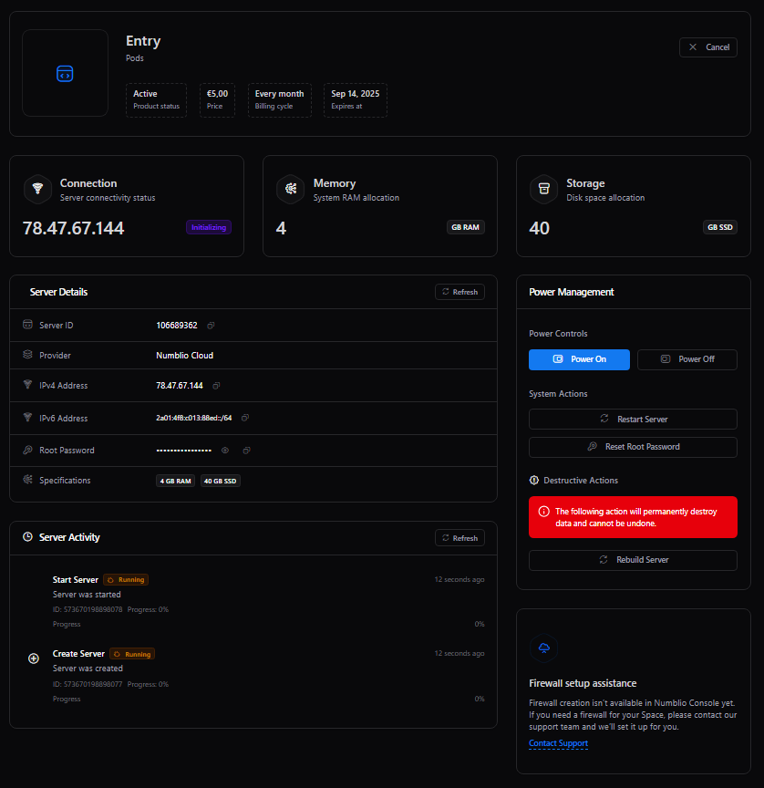
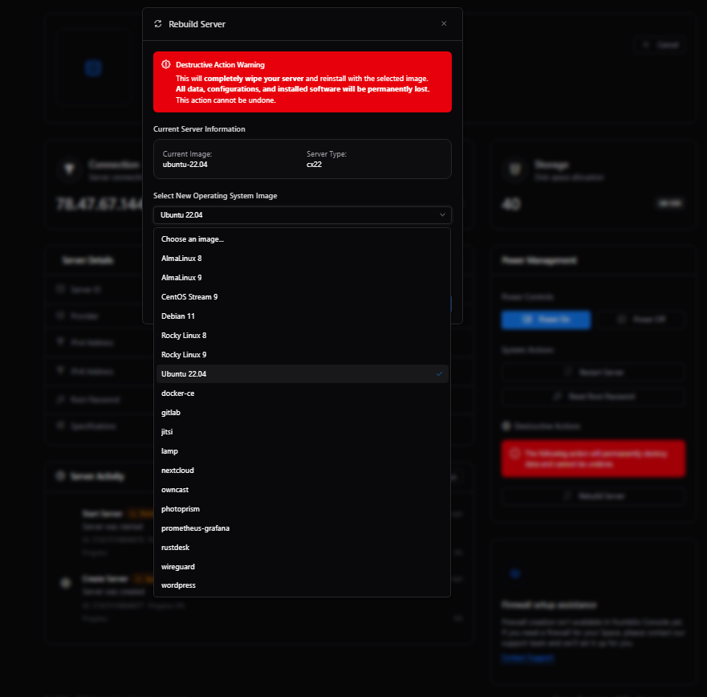
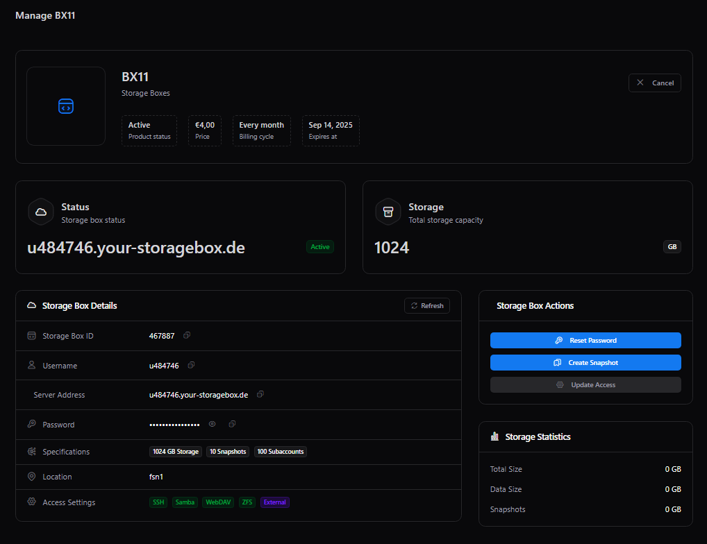
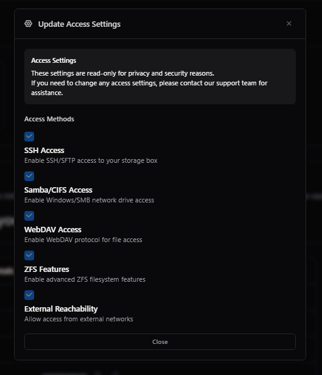

[![Contributors][contributors-shield]][contributors-url]
[![Stars][stars-shield]][stars-url]
[![Issues][issues-shield]][issues-url]
![Paymenter Version][version-shield]
[![MIT License][license-shield]][license-url]

# Hetzner Extensions for [paymenter.org](https://github.com/Paymenter/Paymenter)

This repository contains Hetzner extensions for Paymenter, offering two separate extensions for different Hetzner services:

## 📦 Available Extensions (Paymenter v1.2)

### **hetznerCLOUD** - Cloud Servers Extension
Located in the `hetznerCLOUD/` folder, this extension allows Paymenter v1.2 to sell Hetzner Cloud servers. Built around the [api.hetzner.cloud](https://api.hetzner.cloud) API, it enables automated provisioning and management of cloud servers.

### **hetznerSTORAGE** - Storage Boxes Extension  
Located in the `hetznerSTORAGE/` folder, this extension allows Paymenter v1.2 to sell Hetzner Storage Boxes. Built around the [api.hetzner.com](https://api.hetzner.com) API, it enables automated provisioning and management of storage solutions.

## 🔄 Migration from v0.9

These new extensions are complete rewrites of the original Hetzner Cloud extension (now archived in the `archive/` folder) and are designed specifically for **Paymenter v1.2**. The old v0.9 extension in the archive folder is no longer maintained and only worked with Paymenter v0.9.x.

> **Note:** These extensions are designed for the newest version of Paymenter (v1.2) and replace the legacy v0.9 extension.

## 🚀 Features Overview

Both extensions provide comprehensive management capabilities for their respective Hetzner services, including automated provisioning, monitoring, and control features designed specifically for Paymenter v1.2.

### Development & Contributions
If you want to implement new features, check out:
- **Cloud Servers**: [Hetzner Cloud API Docs](https://docs.hetzner.cloud/) 
- **Storage Boxes**: [Hetzner Storage API Docs](https://docs.hetzner.com/)

Feel free to make a pull request! ❤️

For support or feature requests please message [@404nova or @ha1fdan](https://discord.gg/7rytXKvxMt) on discord.

## 📋 Legacy Extension (Archive)

The `archive/` folder contains the original Hetzner Cloud extension that was built for Paymenter v0.9.x. This extension is no longer maintained and has been completely rewritten and split into two separate extensions for Paymenter v1.2.

---

## 📸 Screenshots

### hetznerCLOUD Extension (Cloud Servers)

Front page

Rebuild modal

### hetznerSTORAGE Extension (Storage Boxes)

Storage Box Information & Management

Storage Box Configuration

[contributors-shield]: https://img.shields.io/github/contributors/ha1fdan/HetznerCloudExtension.svg?style=for-the-badge
[contributors-url]: https://github.com/ha1fdan/HetznerCloudExtension/graphs/contributors
[stars-shield]: https://img.shields.io/github/stars/ha1fdan/HetznerCloudExtension.svg?style=for-the-badge
[version-shield]: https://img.shields.io/badge/Paymenter_version-v1.2-blue?style=for-the-badge

[stars-url]: https://github.com/ha1fdan/HetznerCloudExtension/stargazers
[issues-shield]: https://img.shields.io/github/issues/ha1fdan/HetznerCloudExtension.svg?style=for-the-badge
[issues-url]: https://github.com/ha1fdan/HetznerCloudExtension/issues
[license-shield]: https://img.shields.io/github/license/ha1fdan/HetznerCloudExtension.svg?style=for-the-badge
[license-url]: https://github.com/ha1fdan/HetznerCloudExtension/blob/master/LICENSE
